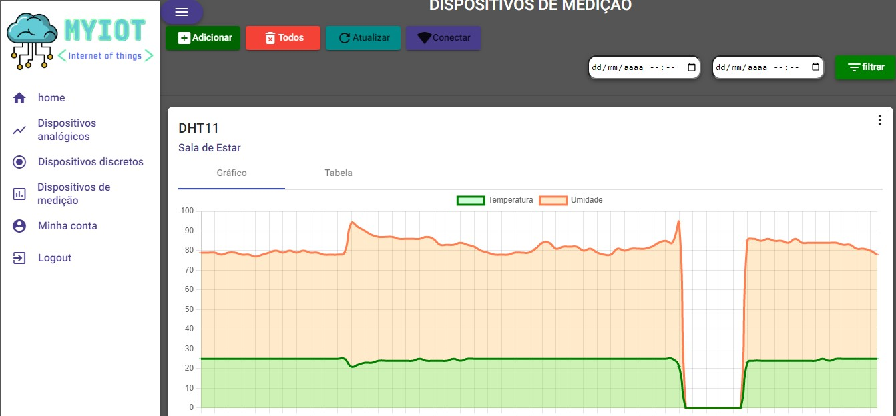
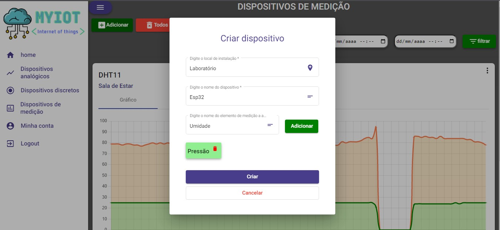
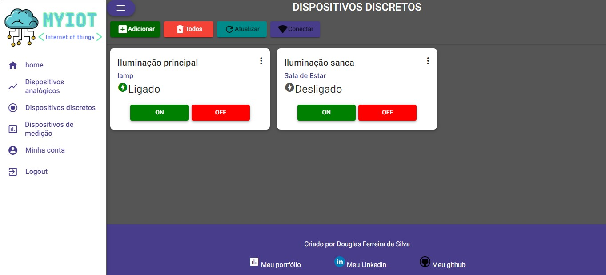
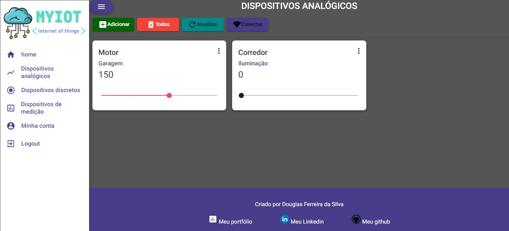

# Myiot

Este projeto é um frontend desenvolvido em Angular com a finalidade de se comunicar com a API [https://github.com/DougFSilva/MyIOT-backend](https://github.com/DougFSilva/MyIOT-backend). A aplicação possibilita a criação de uma conta de usuário, que deve ser aprovada por outro usuário de perfil admin. Criada a conta o usuário pode cadastrar dispositivos para medição, sinais discretos e sinais analógicos. Os dispositivos de medição publicam os valores medidos em um tópico MQTT específico, então a API recebe o valor pelo Broker MQTT, persiste no banco de dados e envia o valor via websocket para o frontend. Os dispositivos discretos recebem um valor de true ou false possibilitando ligar ou desligar um motor por exemplo. E os dispositivos analógicos recebem um valor que varia entre 0 e 256, permitindo controlar por exemplo a intensidade de iluminação de uma lâmpada. Mais detalhes do funcionamento da API em si veja em [https://github.com/DougFSilva/MyIOT-backend](https://github.com/DougFSilva/MyIOT-backend).

Exemplo de tela de um dispositivos de medição 

Exemplo de tela de cadastro de um dispositivo de medição 

Exemplo de tela de um dispositivo discreto 

Exemplo de tela de um dispositivo analógico 

## 🚀 Começando
Para utilizar a aplicação em conjunto com a API de forma bem simples utilizando docker compose, siga as orientações em: [https://github.com/DougFSilva/MyIOT-backend](https://github.com/DougFSilva/MyIOT-backend). 

## 🛠️Construído com

* Angular
* Sockjs
* Stompjs
---
## ✒️ Autor
* Douglas Ferreira da Silva
